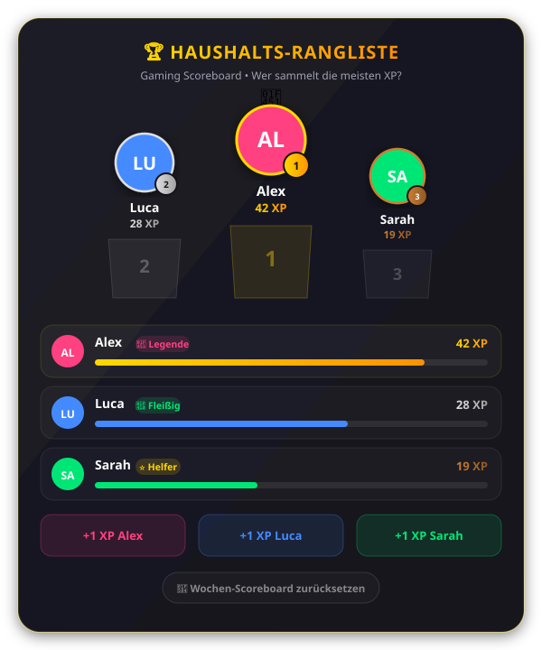

# 🏆 Household Scoreboard Card for Home Assistant

[](https://github.com/hacs/default)
[](https://github.com/buktahula/household-scoreboard-card/releases)
[](https://opensource.org/licenses/MIT)

Ein spielerisches **Haushalts-Scoreboard & Gamification-Card** für Home Assistant Lovelace Dashboards. 
Motiviere die ganze Familie oder WG bei täglichen Aufgaben: Wer eine Aufgabe erledigt (z. B. Müll rausgestellt, Spülmaschine ausgeräumt, To-Dos abgehakt), bekommt XP gutgeschrieben und steigt im Rang auf!

<p align="center">
  
</p>

---

## ✨ Features

* 🥇 **Siegertreppchen (Podium):** Platz 1 mit goldener Krone 👑 in der Mitte, flankiert von Platz 2 (Silber) und Platz 3 (Bronze).
* ⚡ **Level- & Rang-System:** Automatische Fortschrittsbalken und Ränge:
  * 🌱 **Novize** (0–4 XP)
  * ⭐ **Helfer** (5–14 XP)
  * 🐝 **Fleißig** (15–29 XP)
  * ⚡ **Profi** (30–49 XP)
  * 👑 **Legende** (ab 50 XP)
* 🔥 **Streak-System (Tages-Serien):** Belohnt regelmäßigen Fleiß mit Flammen-Badges (`🔥 5`) für aufeinanderfolgende Tage mit erledigten Aufgaben – wahlweise mit automatischem Browser-Speicher oder HA-Zähler-Entity.
* 🎲 **"Wer ist dran?" (Aufgaben-Roulette):** Spielerische Zufallsauswahl für Aufgaben mit animierter Slot-Machine und fairer Gewichtung (Spieler mit weniger XP haben höhere Chancen).
* 🏷️ **Smarte Aufgaben-Icons & Kategorien:** Automatische Icon-Erkennung für Küche 🍽️, Müll 🗑️, Saugen/Boden 🧹, Wäsche 🧺, Bad 🚿, Einkauf 🛒, Pflanzen 🌱, Haustiere 🐾 und mehr.
* 🔊 **Retro-Soundeffekte:** Integrierter 8-Bit-Synthesizer via Web Audio API (Münzsound bei Punkten, Fanfare bei Quests, Roulette-Klicks) – inklusive Stummschalter 🔊/🔇 direkt auf der Karte.
* 🎮 **Integrierte Schnell-Aktionsbuttons (+1 XP):** Direkt auf der Karte mit einem Klick Punkte gutschreiben – inklusive haptischem Feedback und latenzfreier Live-Aktualisierung.
* 📋 **To-Do-Listen & Quests-Integration:** Integriere beliebige Home Assistant To-Do-Listen (`todo.*`). Aufgaben können direkt auf der Karte abgehakt werden.
* 🔥 **Dynamisches Kopfgeld (Bounty-System):** Bleibt eine Aufgabe liegen, steigt die Belohnung automatisch mit jedem überfälligen Tag an (`bonus: +10`).
* 🔄 **Flexibler Auto-Reset nach Tagen:** Aufgaben wiederholen sich automatisch nach `N` Tagen (z. B. `reset: 1` für täglich, `reset: 3` für alle 3 Tage, `reset: 7` für wöchentlich).
* 🎉 **Konfetti-Effekt & Spieler-Schnellauswahl:** Beim Abhaken wählst du einfach den Erlediger aus und die Punkte fliegen mit Konfetti auf dessen Konto!
* ➖ **Korrektur-Option:** Mit optionalem Minus-Button zur schnellen Korrektur von Fehlklicks.
* 🔄 **Saison- / Wochen-Reset:** Optionaler Reset-Button mit Sicherheitsabfrage zum Zurücksetzen aller Punkte auf 0.
* 🖼️ **Automatische Avatare:** Liest Profilbilder direkt aus `person.*`-Entities oder erlaubt eigene Bild-URLs. Falls kein Bild vorhanden ist, werden automatisch stilvolle Initialen-Badges generiert.
* 🌓 **Responsive & Theme-kompatibel:** Passt sich automatisch an Dark- und Light-Themes sowie Smartphone-, Tablet- und Desktop-Layouts an.
* ⚙️ **Grafischer UI-Editor:** Vollständig über den visuellen Home Assistant Dashboard-Editor konfigurierbar.

---

## 📦 Installation

### Methode 1: Über HACS (Empfohlen)

1. Öffne **HACS** in deinem Home Assistant.
2. Klicke oben rechts auf das Drei-Punkte-Menü `⋮` und wähle **Benutzerdefinierte Repositories** (*Custom repositories*).
3. Gib die Repository-URL ein:
   ```text
   https://github.com/buktahula/household-scoreboard-card
   ```
4. Wähle als Typ: **Lovelace** (oder *Dashboard* / *Plugin*).
5. Klicke auf **Hinzufügen** (*Add*).
6. Suche nach **Household Scoreboard Card**, klicke darauf und wähle **Herunterladen** (*Download*).
7. Lade die Dashboard-Seite im Browser neu (`Strg` + `F5`).

---

### Methode 2: Manuelle Installation

1. Lade die Datei [`household-scoreboard-card.js`](https://raw.githubusercontent.com/buktahula/household-scoreboard-card/main/household-scoreboard-card.js) herunter.
2. Kopiere die Datei in deinen Home Assistant Ordner `config/www/` (z. B. `config/www/household-scoreboard-card.js`).
3. Gehe in Home Assistant zu **Einstellungen** ➔ **Dashboards** ➔ **Drei Punkte oben rechts** ➔ **Ressourcen**.
4. Klicke auf **Ressource hinzufügen**:
   * **URL:** `/local/household-scoreboard-card.js`
   * **Ressourcentyp:** `JavaScript-Modul`
5. Lade dein Dashboard neu.

---

## 🚀 Schnellanleitung

Erstelle für jeden Spieler einen Zähler-Helfer (*Counter*) unter **Einstellungen ➔ Geräte & Dienste ➔ Helfer ➔ Zähler** (z. B. `counter.punkte_alex`).

### Option A: 100% über die Benutzeroberfläche (UI Editor)
1. Klicke im Dashboard auf **Karte hinzufügen** (`+`).
2. Wähle **Household Scoreboard Card** aus.
3. Konfiguriere alles bequem über die grafische Oberfläche:
   - **👥 Spieler:** Spieler hinzufügen, Zähler- und Person-Entitäten aus Autocomplete-Dropdowns wählen, Farben per Klick anpassen.
   - **⚙️ Allgemein:** Titel, Untertitel und Einheit (z. B. XP oder Sterne) einstellen.
   - **🎛️ Anzeige & Aktionen:** Podium, Rangliste, Aktionsbuttons und Schrittweite aktivieren oder anpassen.
   - **🔄 Reset:** Wöchentlichen Reset-Button mit Bestätigungsabfrage aktivieren.
4. Klicke auf **Speichern** – fertig! Kein YAML erforderlich.

### Option B: Über YAML-Code
Falls du den Code-Editor bevorzugst, kannst du die Karte auch wie gewohnt über YAML konfigurieren:

```yaml
type: custom:household-scoreboard-card
title: "🏆 Haushalts-Rangliste"
subtitle: "Gaming Scoreboard • Wer macht heute die meisten Aufgaben?"
show_podium: true
show_ranks: true
show_actions: true
show_reset: true
unit: "XP"
players:
  - name: Alex
    entity: counter.punkte_alex
    person: person.alex
    color: "#448aff"
  - name: Luca
    entity: counter.punkte_luca
    person: person.luca
    color: "#00e676"
  - name: Sarah
    entity: counter.punkte_sarah
    person: person.sarah
    color: "#ff4081"
```

---

## ⚙️ Konfigurations-Optionen

### Karten-Optionen

| Parameter | Typ | Standard | Beschreibung |
| :--- | :--- | :--- | :--- |
| `type` | `string` | **Erforderlich** | Immer `custom:household-scoreboard-card` |
| `players` | `list` | **Erforderlich** | Liste der Spieler (siehe Tabelle unten) |
| `title` | `string` | `🏆 Haushalts-Rangliste` | Titel der Karte |
| `subtitle` | `string` | `Gaming Scoreboard ...` | Untertitel oder Motto |
| `unit` | `string` | `XP` | Punkte-Einheit (z. B. `XP`, `Punkte`, `⭐`) |
| `show_podium` | `boolean` | `true` | Siegertreppchen (Top 3) anzeigen |
| `show_ranks` | `boolean` | `true` | Vollständige Rangliste mit Fortschrittsbalken |
| `show_streaks` | `boolean` | `true` | 🔥 Flammen-Badges für tägliche Serien anzeigen |
| `show_actions` | `boolean` | `true` | Schnell-Buttons (+1 XP) je Spieler anzeigen |
| `action_step` | `number` | `1` | Wieviele Punkte pro Klick vergeben werden |
| `allow_decrement` | `boolean` | `true` | Zeigt kleinen Minus-Button zur Korrektur |
| `todo_entity` | `string` | `''` | Optional: To-Do-Liste für Aufgaben (z. B. `todo.haushalt`) |
| `show_todo` | `boolean` | `true` | Aufgabenliste auf der Karte anzeigen |
| `todo_title` | `string` | `📋 Aufgaben & Quests` | Überschrift für den Aufgaben-Bereich |
| `show_task_icons` | `boolean` | `true` | 🏷️ Automatische Kategorie-Icons für Aufgaben anzeigen |
| `show_roulette` | `boolean` | `true` | 🎲 "Wer ist dran?"-Roulette-Button anzeigen |
| `enable_sound` | `boolean` | `true` | 🔊 Retro-Soundeffekte (Web Audio) aktivieren |
| `show_reset` | `boolean` | `false` | Button zum Zurücksetzen aller Zähler |
| `reset_text` | `string` | `Wochen-Scoreboard zurücksetzen` | Text des Reset-Buttons |
| `reset_confirm` | `string` | `...` | Bestätigungstext vor dem Reset |
| `levels` | `list` | *Standard-Ränge* | Eigene Ränge und Schwellenwerte (optional) |

---

### 📋 Aufgaben-Tags (im Titel oder in der Beschreibung)

Du kannst Tags entweder direkt im **Aufgabentitel** (z. B. beim schnellen Hinzufügen) oder in der **Beschreibung** der Home Assistant To-Do-Aufgabe angeben. Tags im Titel werden auf der Karte automatisch ausgeblendet, sodass der Name sauber bleibt!

| Tag | Bedeutung | Unterstützte Formate |
| :--- | :--- | :--- |
| **XP / Punkte** | Basis-Belohnung (Standard: 10 XP) | `[xp: 25]`, `[25 xp]`, `xp: 25`, `[punkte: 20]`, `[20 punkte]` |
| **Fälligkeit** | Fälligkeitsdatum | `[fällig: morgen]`, `[fällig: heute]`, `[fällig: 15.10.2026]`, `[due: 2026-10-15]` *(oder natives HA-Fälligkeitsdatum)* |
| **Kopfgeld (Bonus)** | Zusätzliche XP pro Tag bei Überfälligkeit | `[bonus: +10]`, `[bonus: 10]`, `[+10/Tag]`, `[kopfgeld: 10]`, `bonus: +5` |
| **Wiederholung** | Automatischer Reset nach N Tagen | `[täglich]`, `[reset: 1]`, `[alle 3 Tage]`, `[wöchentlich]`, `[reset: 7]` |
| **Icon** | Manuelles Emoji-Icon für die Aufgabe | `[icon: 🍕]`, `[icon: 🧹]`, `icon: 🧺` |
| **Kategorie** | Manuelle Kategorie für Farb-Akzent | `[cat: kueche]`, `[cat: muell]`, `[cat: bad]` |

*Beispiele für Aufgabennamen oder Beschreibungen in Home Assistant:*
```text
Spülmaschine ausräumen [xp: 25] [alle 2 Tage] [bonus: +5] [fällig: morgen]
```
```text
Küche putzen [täglich] [+10/Tag] [icon: 🧽]
```

### Spieler-Optionen (`players`)

| Parameter | Typ | Beschreibung |
| :--- | :--- | :--- |
| `name` | `string` | **Erforderlich:** Name des Spielers (z. B. `Alex`) |
| `entity` | `string` | **Erforderlich:** Counter- oder Input-Number-Entity (z. B. `counter.punkte_alex`) |
| `notify_service` | `string` | Optional: Smartphone-Benachrichtigungsdienst für Push-Nachrichten (z. B. `notify.mobile_app_alex_phone`). |
| `person` | `string` | Optional: Zugehörige `person.*`-Entity für das automatische Profilbild |
| `streak_entity`| `string` | Optional: Counter-Entity für den Streak (z. B. `counter.streak_alex`). Falls nicht angegeben, speichert die Karte Serien automatisch im Browser. |
| `image` | `string` | Optional: Direkte Bild-URL oder Pfad (überschreibt das Bild der Person) |
| `color` | `string` | Optional: Eigene Akzentfarbe (z. B. `#448aff`, `rgba(68,138,255,1)`) |

---

### 📱 Actionable Push-Benachrichtigungen (Aufgaben direkt am Handy abhaken)

Wenn eine Aufgabe per Aufgaben-Roulette 🎲 ausgelost wird, kannst du die Person direkt per Button benachrichtigen:

1. **Button im Roulette-Fenster:** Klicke nach der Auslosung auf **`📱 [Name] benachrichtigen`**.
2. **Push-Nachricht aufs Smartphone:** Die Person erhält eine Benachrichtigung über die Home Assistant Companion App:
   > **🎲 Haushalts-Roulette: Du bist dran!**  
   > *Hey Alex! Das Los hat entschieden: Bitte erledige "Spülmaschine ausräumen" (+25 XP)!*  
   > **[ ✅ Erledigt (+25 XP) ]**
3. **Direkt am Handy erledigen:** Tippt die Person auf den Button **"✅ Erledigt"**, wird die To-Do-Aufgabe in Home Assistant automatisch als erledigt markiert und die XP werden dem Spieler gutgeschrieben!

#### 💡 24/7 Hintergrund-Automation (Optional)
Wenn das Dashboard auf einem Wandtablet geöffnet ist, verarbeitet die Karte den Klick automatisch live. Damit das Abhaken per Smartphone auch dann zu 100% zuverlässig im Hintergrund funktioniert, wenn gerade kein Dashboard-Fenster geöffnet ist, kannst du diese einfache Automation in Home Assistant anlegen:

```yaml
alias: "Haushalt: Aufgabe per Benachrichtigung erledigen"
description: "Hakt To-Do-Aufgaben ab und vergibt XP beim Klick auf 'Erledigt' in der Push-Nachricht."
trigger:
  - platform: event
    event_type: mobile_app_notification_action
condition:
  - condition: template
    value_template: "{{ trigger.event.data.action is defined and trigger.event.data.action.startswith('HSC_DONE|') }}"
action:
  - variables:
      parts: "{{ trigger.event.data.action.split('|') }}"
      todo_entity: "{{ parts[1] }}"
      item_id: "{{ parts[2] }}"
      player_entity: "{{ parts[3] }}"
      xp: "{{ parts[4] | int }}"
  - service: todo.update_item
    target:
      entity_id: "{{ todo_entity }}"
    data:
      item: "{{ item_id }}"
      status: completed
  - if:
      - condition: template
        value_template: "{{ player_entity.startswith('counter.') }}"
    then:
      - service: counter.set_value
        target:
          entity_id: "{{ player_entity }}"
        data:
          value: "{{ states(player_entity) | int + xp }}"
    else:
      - service: input_number.set_value
        target:
          entity_id: "{{ player_entity }}"
        data:
          value: "{{ states(player_entity) | float + xp }}"
mode: queued
```

---

## 💡 Automations-Tipp: Punkte automatisch vergeben

Du kannst das Scoreboard mit deinen Automatisierungen verknüpfen, z. B. wenn jemand Aufgaben in `todo.haushalt` erledigt oder auf die Müll-Benachrichtigung klickt:

```yaml
alias: "Haushalt: XP vergeben bei erledigter Aufgabe"
trigger:
  - trigger: state
    entity_id: todo.haushalt
action:
  - action: counter.increment
    target:
      entity_id: counter.punkte_alex
  - action: logbook.log
    data:
      name: "🏆 Scoreboard"
      message: "Alex hat eine Aufgabe erledigt (+1 XP)!"
```

---

## 📄 Lizenz

Dieses Projekt ist unter der [MIT License](LICENSE) lizenziert.
Erstellt von buktahula.
